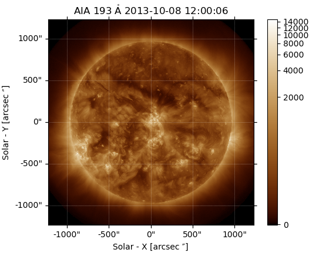
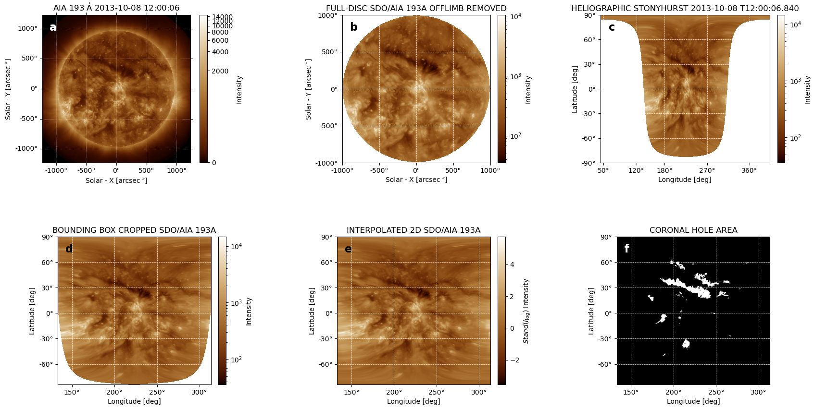

# HSS-SpeedNet-Model



> Prediction of High-Speed Solar Wind Streams using SDO/AIA EUV MAPs/BINARY Maps.
This is a follow up resource for our Research Publication.
---

## Table of Contents

- [About the Project](#about-SpeedNet-Model)
- [Features](#features)
- [Installation](#installation)
- [Usage](#usage)
- [Contributing](#contributing)
- [License](#license)

---

## About SpeedNet Model

The structure of the sun and it ability to influence the propagation of space plasma parcel, realised that different dynamo effect in the sun leads to the generation of solar wind in the interplanetary. The presence of CME (Coronal Mass Ejection) would lead to an abrupt change in the magnitude and effect of solar wind parcel in the interplanetary and near earth. Also, the presence of Coronal hole could create the CIR (Corotating Interaction region) and the SIR (Stream Interaction region), which distort and changes the flow, direction and the magnitude of the Solar wind parcel. This study therefore enacts the prediction of solar wind speed not associated with ICMEs (Interplanetary Coronal Mass Ejection) using Convolution Neural Network (CNN) during the different phases of the solar cycle (SC 24 and 25). 

Solutions:

- Mapping Correctio/Offlimb-removal.
- ICME Eliminnation and Map adaptation based on delays and folds.
- Prediction of High Speed Streams(HSSs).
- Quantitative Evaluation of the Model Performance.
- Grad-Cam Observation of the model performance.


---

## Features

- Feature 1: Description
- Feature 2: Description
- Feature 3: Description

---

## Installation

Follow these steps to install the project:

```bash
# Clone the repository
git clone https://github.com/Abrahamalowonle/HSS-SpeedNet-Model.git

# Navigate to the project directory
cd HSS-SpeedNet-Model

# Install dependencies
npm install # or pip install -r requirements.txt, etc.

```
---

## Usage

How to use the project:

```bash
#Note we recommend utilizing WSL.
# To Utilize WSL
conda create --name env_tf python==3.9.19
conda activate env_tf
conda install -c conda-forge cudatoolkit=11.2.2 cudnn=8.1.0
mkdir -p $CONDA_PREFIX/etc/conda/activate.d
echo 'export LD_LIBRARY_PATH=$LD_LIBRARY_PATH:$CONDA_PREFIX/lib/' > $CONDA_PREFIX/etc/conda/activate.d/env_vars.sh
pip install --upgrade pip
# pip install tensorflow==2.9
```

---

## Contributing

Contributions are welcome! Please follow these steps to contribute:

1. Fork the repository.
2. Create a new branch (`git checkout -b feature-branch-name`).
3. Commit your changes (`git commit -m 'Add some feature'`).
4. Push to the branch (`git push origin feature-branch-name`).
5. Open a Pull Request.

---

## License

This project is licensed under the MIT License. See the [LICENSE](./LICENSE) file for details.
